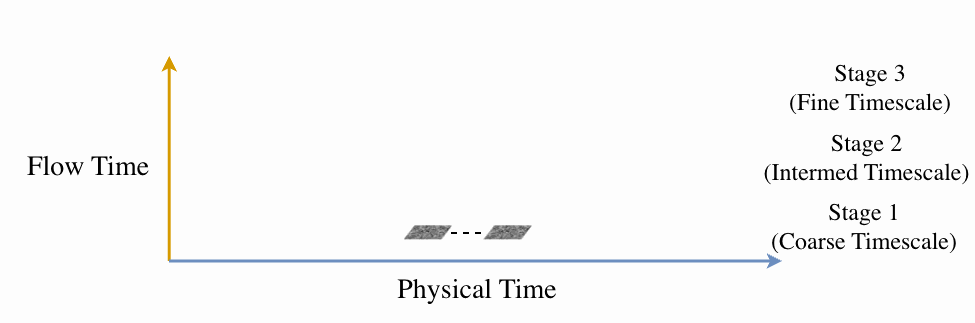
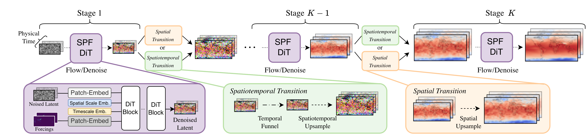
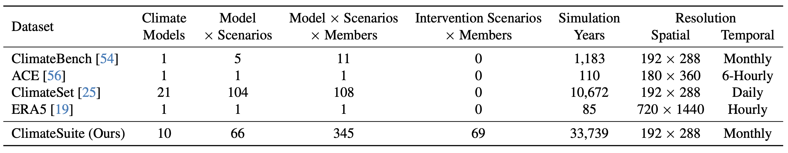
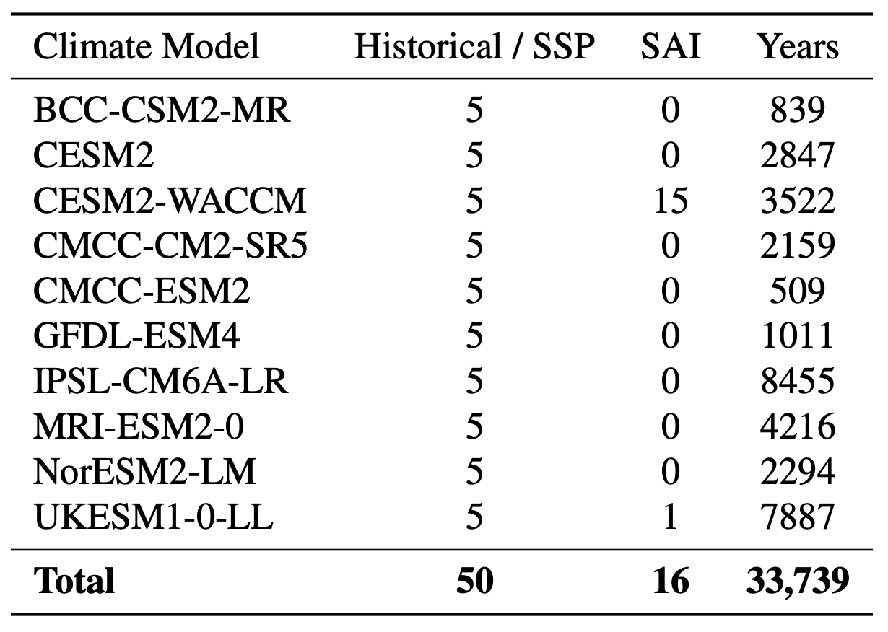
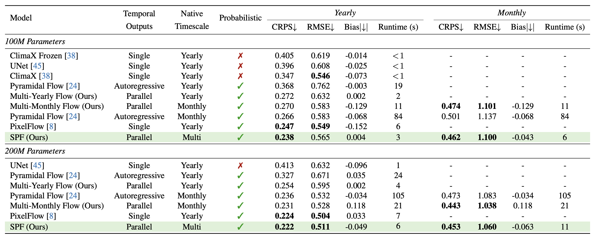
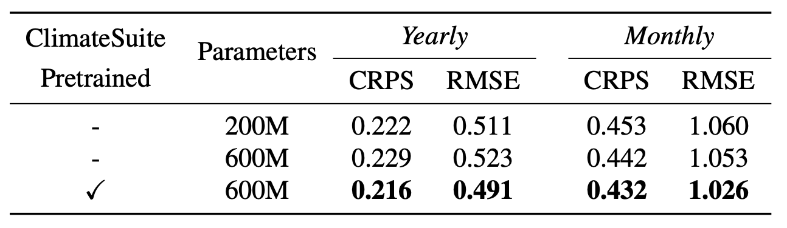
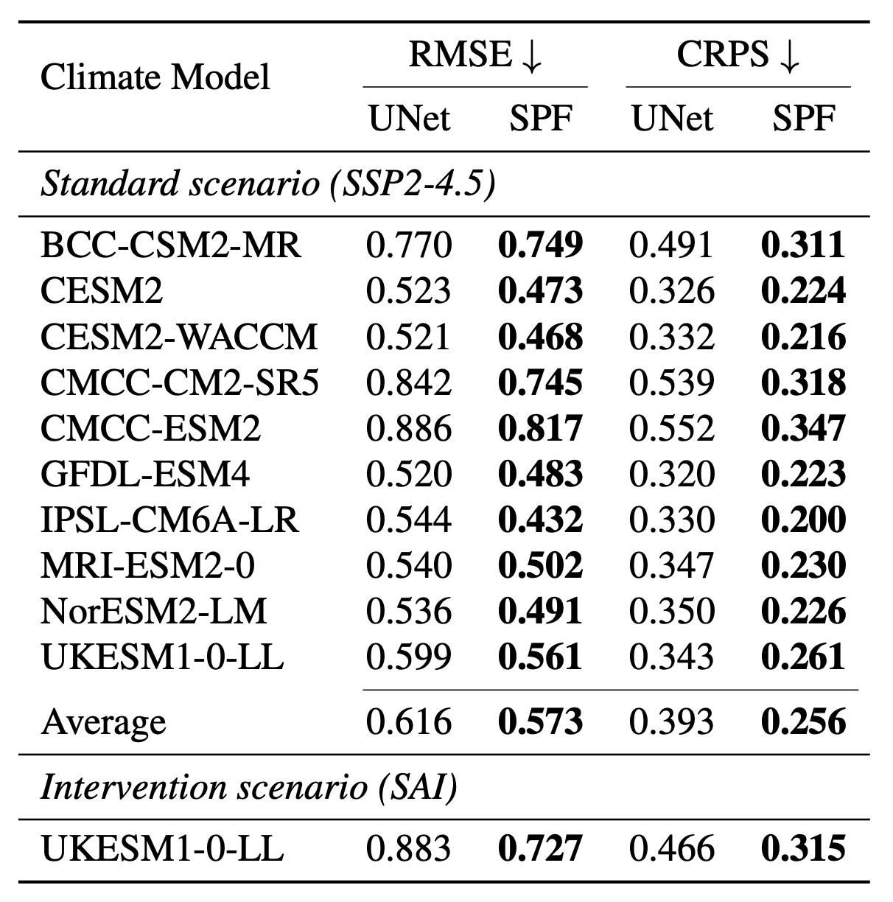

<h2 align="center"> <a href="https://arxiv.org/abs/2512.02268">Spatiotemporal Pyramid Flow Matching for Climate Emulation [CVPR 2026]</a></h2>
<h5 align="center"> If you like this project, please give us a star ⭐ on GitHub and watch 👀 for updates!</h2>


<h5 align="center">

[](https://arxiv.org/abs/2512.02268)
[](https://github.com/ermongroup/TEOChat/blob/main/LICENSE)


</h5>

## 📰 News
* **[2026.2.20]** 🔥 Our work has been accepted to **CVPR 2026**! 
* **[2025.12.02]** 🎉 Our [paper](https://arxiv.org/abs/2512.02268) is available! Dataset and code will be released soon. Please feel free to **watch** 👀 this repository for updates.

## Table of Contents

* [Highlights](#-highlights)
* [Main Results](#-main-results)
* [Requirements and Installation](#%EF%B8%8F-requirements-and-installation)
* [Training & Validating](#%EF%B8%8F-training--validating)
* [License](#-license)
* [Acknowledgements](#-acknowledgements)
* [Citation](#%EF%B8%8F-citation)

## ⭐ Highlights 

**Spatiotemporal Pyramid Flows (SPFs)** are a new class of flow matching approaches to efficiently generate samples of future climate trajectories at different timescales.

<div align="center">
  
</div>

### 🤖 SPF Model Design
SPF divides generation into stages, each beginning with DiT denoising and followed by either a spatiotemporal transition (green) or a spatial-only transition (orange). Spatiotemporal transitions funnel into a timestep for the selected target period
and upsample the latent in both space and time, while spatial transitions upsample only in space. This sequence of denoising and stage transitions continues until the final stage, which outputs clean samples at the target period and timescale.

<div align="center">
  
</div>

### 📚 ClimateSuite: A new large-scale climate dataset for ML emulation
We introduce a new dataset for climate emulation called **ClimateSuite** which we use to train a scaled version of SPF. ClimateSuite, comprises more than 33,000 simulation-years of climate data spanning 276 state-of-the-art simulations from 10 ESMs and
39 stratospheric aerosol injection (SAI) simulations.

<div align="center">
  
  <p><em>Comparison of ClimateSuite to existing climate-scale datasets.</em></p>
</div>

<div align="center">
  
  <p><em>Climate model and scenario breakdown in ClimateSuite.</em></p>
</div>

## 📊 Main Results
We demonstrate that SPFs:
- obtain superior accuracy and inference efficiency compared to strong deterministic baselines, pre-trained models, and flow matching approaches on ClimateBench.
- achieve good generalization to emissions and intervention scenarios across climate models when trained on ClimateSuite.
- obtain further improved performance on ClimateBench after fine-tuning a model pre-trained on ClimateSuite.

### ClimateBench Results
<div align="center">
  
  <p><em>ClimateBench test metrics on held-out scenario (SSP2-4.5).</em></p>
</div>

### ClimateSuite Results
<div align="center">
  
  <p><em>Effect of scale and ClimateSuite pre-training on ClimateBench performance.</em></p>
</div>

<div align="center">
  
  <p><em>Yearly metrics on held-out scenarios across climate models in ClimateSuite.</em></p>
</div>


## 🛠️ Requirements and Installation
Package requirements and installation directions will be posted soon.

## 🗝️ Training & Validating
The training & validating instructions, including how to download the ClimateSuite dataset, will be posted soon.

## 👍 Acknowledgements
* [Pyramid Flows](https://github.com/jy0205/Pyramid-Flow) The model we built upon.
* [ClimateSet](https://github.com/RolnickLab/ClimateSet) The codebase and dataset we built upon. 

## 🔒 License
* This project is released under the Apache 2.0 license as found in the [LICENSE](https://github.com/stanfordmlgroup/spf/blob/main/LICENSE) file.

## ✏️ Citation
If you find our paper and code useful in your research, please consider giving a star :star: and citation :pencil:.

```BibTeX
@article{irvin2025spatiotemporal,
  title={Spatiotemporal Pyramid Flow Matching for Climate Emulation},
  author={Irvin, Jeremy Andrew and Han, Jiaqi and Wang, Zikui and Alharbi, Abdulaziz and Zhao, Yufei and Bayarsaikhan, Nomin-Erdene and Visioni, Daniele and Ng, Andrew Y. and Watson-Parris, Duncan},
  journal={arXiv preprint arXiv:2512.02268},
  year={2025}
}
```
